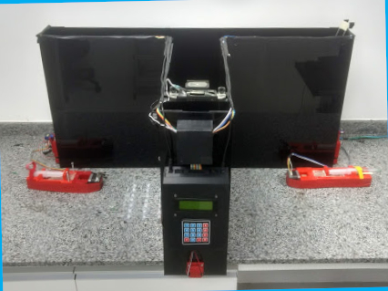

# T-MAZE
T-MAZE experimental box

T-mazes are behavioral boxes for rodents, widely used by the scientific community for memory and learning studies. 
In this work, a T-Maze was developed containing an automated rewards system that provides micro doses of water to 
the rodent in a controlled manner, when it gets right the task proposed by the experiment. For this, low cost sensors
and actuators were used; all controlled using the Arduino platform. The labyrinth structure and 3D modeling of the
rewards system were developed using SketchUp drawing software. The goal of this project is to develop an open-hardware 
T-maze, which can be replicated by other research centers using only simple machining and 3D printing.

There are 5 trainning mode for the rats, which can be selected through a keypad and a LCD Display.
It was developed Library for the project (T_Maze.h). An overview of the device can be seen at Fig 1:

<a>
    

        

            
            <h5 style="color:black;" align="middle">Figure 1 - 3D CAD visualizattion from the device</h5>
        

    

</a>
